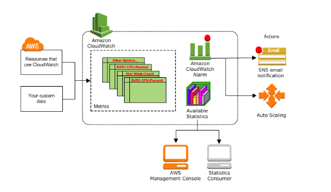

# Amazon CloudWatch

## Concepts

> Amazon CloudWatch monitors your Amazon Web Services (AWS) resources and the applications you run on AWS in real time. You can use CloudWatch to collect and track metrics, which are variables you can measure for your resources and applications.

-AWS-[What Is Amazon CloudWatch?](https://docs.aws.amazon.com/AmazonCloudWatch/latest/monitoring/WhatIsCloudWatch.html)

-AWS-[How Amazon CloudWatch Works](https://docs.aws.amazon.com/AmazonCloudWatch/latest/monitoring/cloudwatch_architecture.html)

> A namespace is a container for CloudWatch metrics. Metrics in different namespaces are isolated from each other, so that metrics from different applications are not mistakenly aggregated into the same statistics.

&nbsp;

> There is no default namespace. You must specify a namespace for each data point you publish to CloudWatch.

&nbsp;

> The AWS namespaces typically use the following naming convention: AWS/service.

&nbsp;

> Metrics are the fundamental concept in CloudWatch. A metric represents a time-ordered set of data points that are published to CloudWatch.

&nbsp;

> Metrics exist only in the Region in which they are created. Metrics cannot be deleted, but they automatically expire after 15 months if no new data is published to them

&nbsp;

> Each metric data point must be associated with a time stamp. The time stamp can be up to two weeks in the past and up to two hours into the future. If you do not provide a time stamp, CloudWatch creates a time stamp for you based on the time the data point was received.

&nbsp;

> CloudWatch retains metric data as follows:

* Data points with a period of less than 60 seconds are available for 3 hours. These data points are high-resolution custom metrics.

* Data points with a period of 60 seconds (1 minute) are available for 15 days

* Data points with a period of 300 seconds (5 minute) are available for 63 days

* Data points with a period of 3600 seconds (1 hour) are available for 455 days (15 months)

> Data points that are initially published with a shorter period are aggregated together for long-term storage.

&nbsp;

> A dimension is a name/value pair that is part of the identity of a metric. You can assign up to 10 dimensions to a metric.

&nbsp;

> Metrics are uniquely defined by a name, a namespace, and zero or more dimensions.

&nbsp;

> Dimensions: Server=Prod, Domain=Frankfurt, Unit: Count, Timestamp: 2016-10-31T12:30:00Z, Value: 105

**Note:** Think of dimensions like Tags; keeps namespace flatter.

> For metrics produced by certain AWS services, such as Amazon EC2, CloudWatch can aggregate data across dimensions.

&nbsp;

> Statistics are metric data aggregations over specified periods of time.

&nbsp;

> Metric data points that specify a unit of measure are aggregated separately. When you get statistics without specifying a unit, CloudWatch aggregates all data points of the same unit together. If you have two otherwise identical metrics with different units, two separate data streams are returned, one for each unit.

**note:** For statistics, seems like Unit is part of the unique identifier.

> A period is the length of time associated with a specific Amazon CloudWatch statistic. Each statistic represents an aggregation of the metrics data collected for a specified period of time. Periods are defined in numbers of seconds, and valid values for period are 1, 5, 10, 30, or any multiple of 60...  A period can be as short as one second or as long as one day (86,400 seconds). The default value is 60 seconds.

&nbsp;

> For large datasets, you can insert a pre-aggregated dataset called a statistic set. With statistic sets, you give CloudWatch the Min, Max, Sum, and SampleCount for a number of data points.

&nbsp;

> A percentile indicates the relative standing of a value in a dataset. For example, the 95th percentile means that 95 percent of the data is lower than this value and 5 percent of the data is higher than this value. Percentiles help you get a better understanding of the distribution of your metric data.

&nbsp;

> You can use an alarm to automatically initiate actions on your behalf. An alarm watches a single metric over a specified time period, and performs one or more specified actions, based on the value of the metric relative to a threshold over time. The action is a notification sent to an Amazon SNS topic or an Auto Scaling policy. You can also add alarms to dashboards.

&nbsp;

> Alarms invoke actions for sustained state changes only. CloudWatch alarms do not invoke actions simply because they are in a particular state. The state must have changed and been maintained for a specified number of periods.

&nbsp;

> When creating an alarm, select an alarm monitoring period that is greater than or equal to the metric's monitoring period. 

-AWS-[Amazon CloudWatch Concepts](https://docs.aws.amazon.com/AmazonCloudWatch/latest/monitoring/cloudwatch_concepts.html)

## Exercises

